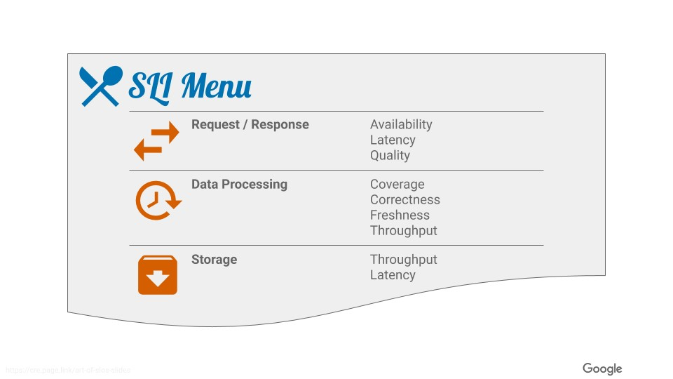

# SLIs and SLOs examples

# Motivation
How reliable is the service you provide to your users? What would be a _good enough_ reliability level for your service? And what would change in how you work with software development if reliability was a feature?  
There is a lot of material out there about SLIs and SLOs, but to me these three simple questions reveal the essence of it.  

In this project I will share a practical example of working with these concepts. I will try and keep it short and to the point, and recommend reading [Google's SRE book](https://sre.google/sre-book/service-level-objectives) if one wants to learn the subject more in depth.

# Terminology
SLIs stand for Service Level Indicators. They are simply the indicators or _measurements_ of your service that speak for its reliability. They will help you with the first question “How reliable is the service you provide to your users?”.

SLOs stand for Service Level Objectives. They are simply your SLIs + objectives or _targets_ for your service’s reliability. They clearly relate to the second question “What would be a _good enough_ reliability level for your service?”, but also to the third one “What would change in how you work with software development if reliability was a feature?”. Once a reasonable reliability target is defined, running below it should invoke action to get back on track, as no one wants to provide an unreliable experience to their users. Or in other words, reliability now becomes an unambiguous feature, and should be fixed if broken.

SLAs stand for Service Level Agreements. They are simply your SLOs + agreements or _consequences_ of breaking the SLOs. These are signed between providers and customers, and the consequences are usually monetary. They directly speak to the third question “What would change in how you work with software development if reliability was a feature?”, as no one wants to lose money. I just wanted to briefly touch on the concept of SLAs since it’s common in the reliability and business world, but won’t go further on it in this project.

# Working with it
Now with the terms covered, it’s time to look at defining SLIs and SLOs for our services.

## Where to start in your organization?
My first advice is to start pragmatically and from your external users' perspective (think user journeys). Look at the "edge" of your service, where your external users interact directly with, and define your SLIs and SLOs there. As your service's system grows in complexity and dependencies, add SLIs and SLOs to the dependencies too. It will be tricky to maintain SLIs and SLOs at the "edge" and to understand where things went wrong if the dependencies do not take their part in it too.

My second advice, as with anything else, is to remain intentional. Do not care too much about measuring, but measure what you care about. It's easy to fall for measuring a lot of things just because one can. Understand what really matters to your users, and focus on those.

## SLIs
Measurements, right?  
The types of measurements that speak for the reliability of your service may vary depending on its nature. In most cases though, they will fall into one of the categories from Google's SLI Menu:

I won’t cover all the different SLIs from the Menu, as one can find more detailed information about [them](https://sre.google/workbook/implementing-slos/#slis-for-different-types-of-services) in Google’s SRE book. I will instead focus on the _Request / Response_ category and maintain a red thread in this project.

- Availability: may be seen as the proportion of successful responses.
- Latency: may be seen as the proportion of responses faster than a threshold.
- Quality: may be seen as the proportion of responses in an undegraded state. These only make sense if your service has fallbacks and can still provide responses in the event something is unavailable at the time of request, although in a gracefully degraded state.

### Standardization
As one can notice, all the SLIs described above have a proportion form to it. SLIs follow the equation of _good events_ / _valid events_. That makes it easy to work with and later set targets on, whatever measurement you need, as long as you can separate good events from the others.

More definitions worth standardizing on per type of measurement and make your life easier are:
- Where you take the measurements, e.g. at the load balancer. There are a few [alternatives](https://www.coursera.org/lecture/site-reliability-engineering-slos/ways-of-measuring-slis-b1b0B), each with pros and cons.
- How frequently you take them, e.g. every 10 seconds, and your aggregation interval, e.g. over 1 minute.

## SLOs
Targets, right?  
The aim with SLOs will be to find the reliability line that divides having happy users and having unhappy users. That is what we call our _good enough_ reliability. It’s easy to agree that setting a too low reliability target will lead to unhappy users. What may not be so obvious is that setting a too high reliability target will lead to, most often, unnecessary effort from your team to maintain it over the course of time. Even if your reliability numbers are super high today, don't lock your SLOs based on that. Many times your users may still be happy with a target less demanding on you. Try to really find your _good enough_ reliability and invest the rest of your time in other types of value to your users.

An example of targets on the _Request / Response_ category would be:
- Availability: 99% of the requests in question will succeed.
- Latency: 90% of the requests in question will complete in less than 10ms, and 99% will complete in less than 100ms.

### Standardization
For the practice to scale well in your organization, it's worth standardizing on a few points:
- Documentation: make it easy to define and find your SLOs, e.g. use a [template](https://docs.google.com/document/d/1SNgnAjRT1jrMa7vGHK0J_0jJEDvKJ5JmTEXFvNRDaHE/edit) and make them easily accessible in a common place.
- Compliance period: the time window your SLOs are evaluated over for operational needs, e.g. 28 rolling days.
- Requirements' categories: use buckets for approximately similar availability requirements, e.g.:
  - HIGH_FAST: high availability and low latency requirements, e.g. 99% availability and latency p99 of 100ms.
  - HIGH_SLOW: important but less latency-sensitive requirements, e.g. 99% availability and latency p99 of 5s.
  - LOW: outages are mostly invisible to users, e.g. 90% availability, and no latency requirement.
- Compliance report: a dashboard with in-time snapshots of your SLOs compliance, for transparent communication with others and for spotting problematic areas.
- Look-back and prioritization: the frequency in which to review your performance against the SLOs, the effort in maintaining them, and your user satisfaction, e.g. fixed calendar quarters.

### Error Budget, Alerting and Ways of Working
Once an SLO is defined, we then get what is called our Error Budget. It is simply the tolerance for our service in a non-compliant state before violating the SLO. For example, with an availability SLO defined that 99% of the requests should succeed, we then get an Error Budget that represents the 1% of the requests that are allowed to fail. In this case, if 0% of the requests have failed, we still have 100% of the Error Budget left; or if 1% of the requests have failed, we have 0% of the Error Budget left.

This brings some interesting operational aspects to the table. It doesn't matter now if 2 SLOs have different targets, we can always operate based on their Error Budgets that start with 100%.

Remember we mentioned that we would like reliability to be seen as a feature? Here is where that comes to life, by defining clear policies on how teams should act when they exhaust their Error Budgets. It's important to come to an agreement with your stakeholders a priori, and some common practices are:
- The team focuses exclusively on reliability issues until the system is within SLO, pushing back on external feature requests.
- A production freeze halts certain changes to the system until there is sufficient error budget to resume changes.

As one can see, the impact of exhausting Error Budgets can be quite high, and ideally we would like to not reach that point. To help with that, we can adopt a more predictive alerting practice, and alert based on the rate that the Error Budget is being consumed. For example, if we would be measuring our SLOs compliance over 10 days, and in a single day we happened to consume more than 10% of our Error Budget, we know what will happen if that is sustained.  

TODO alerting

# Studies on Business Impact
TODO

# Code Example
TODO

# Contributing
If you would like to help making this project better, see the [CONTRIBUTING.md](CONTRIBUTING.md).  

# Maintainers
Send any other comments, flowers and suggestions to [André Schaffer](https://github.com/andreschaffer) and [Jefferson Girão](https://github.com/jeffersongirao).

# License
This project is distributed under the [MIT License](LICENSE).
