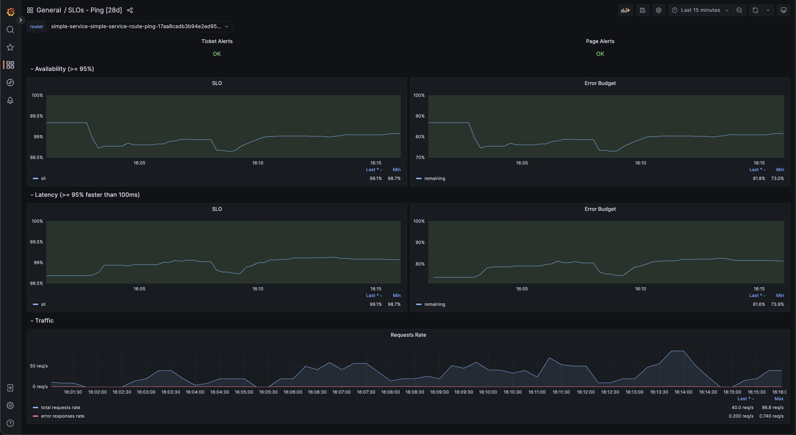

# Dashboard

## Layout

The layout of the dashboard provides the following info around the application's "ping" functionality SLOs:
- Ticket and Page Alerts (based on the rate the application burns down on its SLOs)
- Availability and Latency SLIs and SLOs
- Traffic for some quick correlation with how the application is doing

Additional info, for example for troubleshooting the application, are recommended to live in a separate dashboard.
